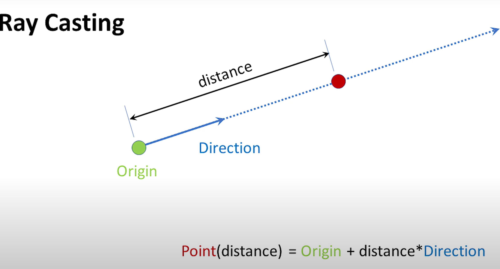
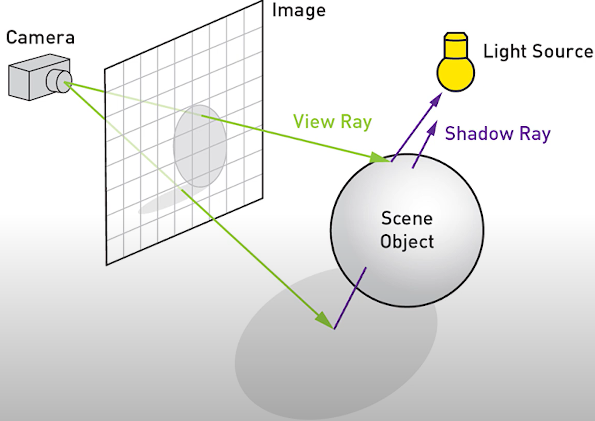
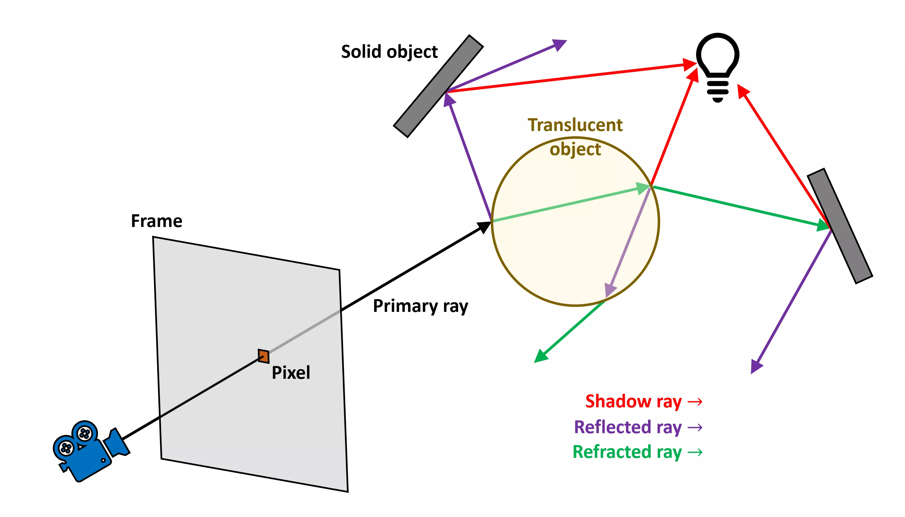
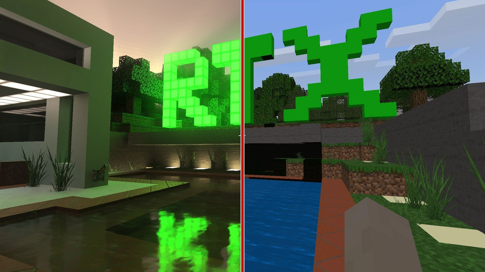

# High level overview

A high-performance ray tracing application written in C++ with a focus on modularity and real-time rendering. This project leverages modern graphics libraries to provide a robust and interactive environment for exploring ray tracing techniques.

Ray tracing is a rendering technique that simulates the way light interacts with objects in a scene to produce highly realistic images. By tracing the paths of individual rays of light, the algorithm calculates reflections, refractions, and shadows.

## Features
- Real-time ray tracing using OpenGL
- Interactive GUI with ImGui
- Cross-platform support via GLFW and CMake

# Basics of Ray Tracing

## What is a Ray?
A ray is a mathematical abstraction used in ray tracing to represent a line in 3D space. It is defined by:

- Origin: The starting point of the ray.
- Direction: A normalized vector that indicates the ray's trajectory.

## What is Ray Casting?

Ray casting is the fundamental operation in ray tracing. It involves:
- Casting rays into a scene from a specific point (e.g., the camera).
- Determining whether and where each ray intersects objects in the scene.

Ray casting can answer questions such as:
- Does the ray intersect with an object?
- What is the closest intersection point?
- What are the surface properties (color, normal, material) at the intersection?

## Shooting Rays Through the Camera and Viewport

In ray tracing, the camera acts as the observer, and the image is formed by projecting rays from the camera's position through a 2D viewport (representing the screen or image plane) into the 3D scene.

### Steps to Shoot Rays:
- Define the Camera:
	- The camera position is the origin of the rays.
	- The viewport is a rectangular grid representing the image plane.
- Generate the Viewport Grid:
	- Divide the viewport into a grid of pixels.
	- Each pixel corresponds to one ray to be traced.
- Calculate Ray Directions:
	- For each pixel, compute the direction vector from the camera's position through the pixel's center on the viewport.
	- Normalize the direction vector.
- Trace Rays:
	- Use the ray equation to check for intersections with objects in the scene.
	- Compute the color at the intersection based on lighting, material properties, and other effects.

As you can see, the rays are reflected from different surfaces. Especially when material is semi transparent we need to take into account refracted rays. We can say that the calculation of ray intersaction needs to be done "recursively".  

### Anti-Aliasing
Anti-aliasing is a technique used to reduce jagged edges (aliasing) in rendered images. This is especially important for high-quality graphics. Common methods include:
- Super-Sampling Anti-Aliasing (SSAA) - Rendering the scene at a higher resolution and downscaling it to smooth edges.
- Multi-Sample Anti-Aliasing (MSAA) - Sampling multiple points within a pixel and averaging the results.
- Fast Approximate Anti-Aliasing (FXAA) - A post-processing technique that smooths edges by analyzing and blending pixels based on their contrast. FXAA is computationally efficient and works well for real-time applications, though it may slightly blur textures.

Anti-aliasing enhances the visual quality of ray-traced images.

As can be seen on image above, when antialiasing is not implemented, in the scenario of such triangle, the pixel with red point in the center will remain blank.
If every pixel on the edge behave like that, we see jagged lines. To resolve that problem I implemented MSAA technique, where each pixel contains more (4 in this case) sample points (right image).
We can see that only 2 of the sample points cover the triangle. The amount of sample points can be any number we'd like with more samples giving us better coverage precision.
<b>Because only 2 of the 4 samples were covered in the previous image, half of the triangle's color is mixed with the framebuffer color (in this case the clear color) resulting in a light blue-ish color.</b>
All that makes image appear more sharp from larger distance.

MSAA technique used to produce sharper image.

### Importance of Ray Tracing
Ray tracing is widely used in:
- Movies and Animation to produce photorealistic images.
- Video Games: For real-time lighting and reflections (e.g. ray tracing in modern GPUs).
- Scientific Visualization: To simulate light physics for accurate visualizations.
- CAD programs

By understanding the basics of rays, ray casting, and shooting rays through a camera, you can build the foundation for more advanced ray tracing techniques such as recursive reflections, global illumination, and path tracing.

In combination with rasterization and anti-aliasing techniques, ray tracing plays a crucial role in rendering high-quality images across various applications.

Things mentioned above are implemented in the project.